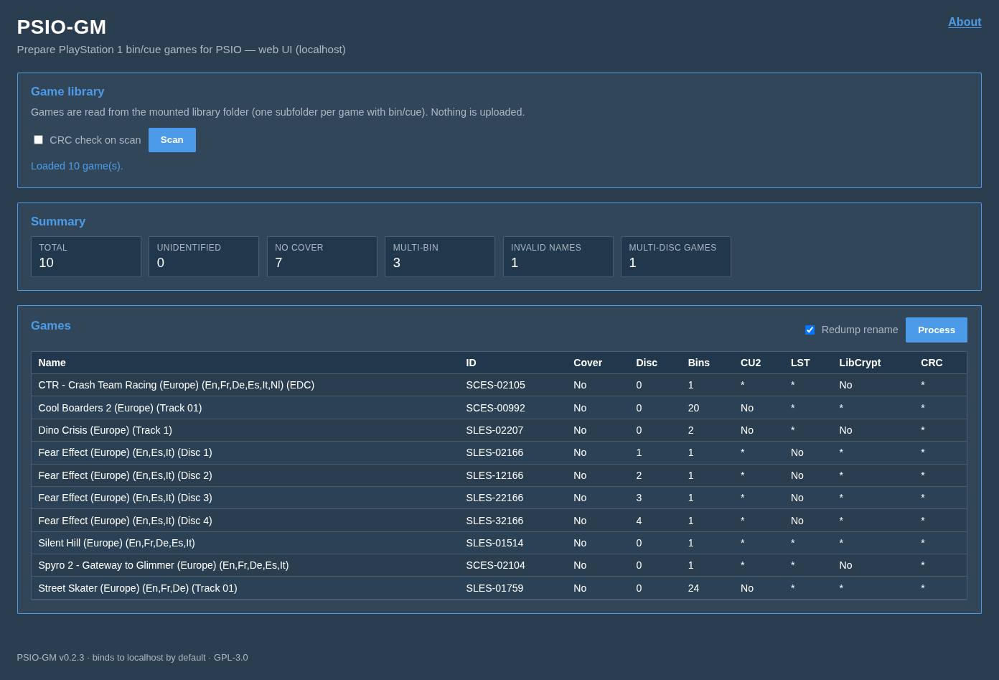

# PSIO-GM
**Version 0.2.2**

Prepare PlayStation 1 bin/cue games for use with a PSIO device.<br>
The all-in-one solution to preparing your PSIO collection.<br>



## About this fork
**PSIO-GM** is a maintained fork of <a href="https://github.com/logi-26/psio-game-manager" target="_blank" rel="noopener noreferrer">logi-26/psio-game-manager</a>.

**v0.2** runs as a **Docker** web app (Flask UI on localhost). Put games in a host folder, start Compose, open the UI. For the older Tk desktop app, use branch **`v0.1`**.

Compared with upstream at the time of forking, this fork includes:

- Safer multi-BIN merging (no delete-before-verify)
- Per-game batch error handling
- Fixes for CU2 track matching, incomplete multi-disc sets, and PPF3 undo detection
- Script-relative resource/DB paths
- Rebrand (PSIO-GM)
- **v0.2** — headless `GameLibraryService` + Flask web UI, **Docker Compose as the supported way to run**

Full detail: <a href="CHANGELOG.md" target="_blank" rel="noopener noreferrer">CHANGELOG.md</a>. Issues: <a href="https://github.com/brokenbadger/psio-gm/issues" target="_blank" rel="noopener noreferrer">GitHub Issues</a>.

**This application:**<br/>
Organises and standardises PlayStation 1 games into a format acceptable by the PSIO device. It performs the following tasks:<br/>

- Works on Linux, Mac and Windows **via Docker**.
- Works in batch mode on all selected games.
- Merges all multi-bin games into single bin files.
- Generates CU2 files for all games that use CDDA audio.
- Adds game cover images for games that do not have them.
- Ensures that game names are not greater than 56 characters and do not contain invalid characters.
- Generates the MULTIDISC.LST file for all multi-disc games and organises them into a single directory.
- Detects and patches games that use LibCrypt.
- OPTIONAL:
- Rename all games using the game names from the PlayStation Redump project.
- Performs CRC-32 checks of each data track using data from the PlayStation Redump project.

## Notes
  - For best performance, use the application with your games stored on a PC HDD and then transfer to an SD card.
  - The application requires the games cue sheet to identify the game.
  - If a game is a single disc game the disc number will be displayed as zero.
  - CRC checks make the process a lot slower (turned off by default).
  - If CRC check is off the CRC column shows an asterisk.
  - If CRC check is on and tracks match Redump the CRC column shows "Yes".
  - If CRC check is on and tracks do not match Redump the CRC column shows "No".
  - If CRC check is on but the database has no Redump track data for that game the CRC column shows an em dash (—), not "No".
##### Multi-disc LST
  - If a game is not part of a collection the LST will be displayed with an asterisk.
  - If a game is part of a collection and an LST file is not present the LST will be displayed with "No".
  - If a game is part of a collection and an LST file is present the LST will be displayed with "Yes".
##### CU2
  - If a game does not require a CU2 file the CU2 will be displayed with an asterisk.
  - If a game does require a CU2 file and one is not present the CU2 will be displayed with "No".
  - If a game does require a CU2 file and one is present the CU2 will be displayed with "Yes".
##### LibCrypt
  - If a game does not use LibCrypt the LibCrypt will be displayed with an asterisk.
  - If a game does use LibCrypt and the BIN file has not been patched the LibCrypt will be displayed with "No".
  - If a game does use LibCrypt and the BIN file has been patched the LibCrypt will be displayed with "Yes".
  - Once a game has had a LibCrypt patch applied the Redump CRC check will show as "No".

## LibCrypt Patches
<details>
  <summary>Click to expand</summary>

  - SLES_031.89 - 102 Dalmatians
  - SLES_031.90 - 102 Dalmatians
  - SLES_031.91 - 102 Dalmatians
  - SLES_012.26 - Actua Ice Hockey 2 (Europe)
  - SLES_025.63 - Anstoss - Premier Manager (Germany)
  - SCES_015.64 - Ape Escape (Europe)
  - SCES_020.28 - Ape Escape (France)
  - SCES_020.29 - Ape Escape (Germany)
  - SCES_020.30 - Ape Escape (Italy)
  - SCES_020.31 - Ape Escape (Spain)
  - SLES_033.24 - Asterix: Mega Madness (Europe)
  - SCES_023.66 - Barbie: Aventure Equestre (France)
  - SCES_023.65 - Barbie: Race & Ride (Europe)
  - SCES_023.67 - Barbie: Race & Ride (Germany)
  - SCES_023.68 - Barbie: Race & Ride (Italy)
  - SCES_023.69 - Barbie: Race & Ride (Spain)
  - SCES_024.88 - Barbie: Sports Extreme (France)
  - SCES_024.89 - Barbie: Super Sport (Germany)
  - SCES_024.87 - Barbie: Super Sports (Europe)
  - SCES_024.90 - Barbie: Super Sports (Italy)
  - SCES_024.91 - Barbie: Super Sports (Spain)
  - SLES_029.77 - BDFL Manager 2001 (Germany)
  - SLES_036.05 - BDFL Manager 2002 (Germany)
  - SLES_030.62 - Bundesliga 2001 – The Football Manager (Europe)
  - SLES_022.93 - Canal+ Premier Manager
  - SLES_027.66 - Cochons de Guerre, Les (France)
  - SCES_028.34 - Crash Bash (Europe)
  - SCES_021.05 - CTR: Crash Team Racing (Europe)
  - SLES_022.07 - Dino Crisis (Europe)
  - SLES_022.08 - Dino Crisis (France)
  - SLES_022.09 - Dino Crisis (Germany)
  - SLES_022.10 - Dino Crisis (Italy)
  - SLES_022.11 - Dino Crisis (Spain)
  - SCES_015.16 - Disney Tarzan (France)
  - SCES_015.18 - Disney Tarzan (Italy)
  - SCES_015.19 - Disney Tarzan (Spain)
  - SCES_014.31 - Disney's Tarzan (Europe)
  - SCES_021.85 - Disney's Tarzan (Netherlands)
  - SCES_021.84 - Disneyn Tarzan (Finland)
  - SCES_021.81 - Disneys Tarzan (Denmark)
  - SCES_015.17 - Disneys Tarzan (Germany)
  - SCES_021.82 - Disneys Tarzan (Sweden)
  - SLES_025.38 - EA Sports Superbike 2000 (Europe)
  - SLES_017.15 - Eagle One: Harrier Attack (Europe)
  - SCES_017.04 - Esto Es Futbol (Spain)
  - SLES_027.22 - F1 2000 (Europe)
  - SLES_027.23 - F1 2000 (Europe)
  - SLES_027.24 - F1 2000 (Italy)
  - SLES_029.67 - Final Fantasy 9 (Germany) (Disc 1)
  - SLES_129.67 - Final Fantasy 9 (Germany) (Disc 2)
  - SLES_229.67 - Final Fantasy 9 (Germany) (Disc 3)
  - SLES_329.67 - Final Fantasy 9 (Germany) (Disc 4)
  - SLES_029.65 - Final Fantasy IX (Europe) (Disc 1)
  - SLES_129.65 - Final Fantasy IX (Europe) (Disc 2)
  - SLES_229.65 - Final Fantasy IX (Europe) (Disc 3)
  - SLES_329.65 - Final Fantasy IX (Europe) (Disc 4)
  - SLES_029.66 - Final Fantasy IX (France) (Disc 1)
  - SLES_129.66 - Final Fantasy IX (France) (Disc 2)
  - SLES_229.66 - Final Fantasy IX (France) (Disc 3)
  - SLES_329.66 - Final Fantasy IX (France) (Disc 4)
  - SLES_029.68 - Final Fantasy IX (Italy) (Disc 1)
  - SLES_129.68 - Final Fantasy IX (Italy) (Disc 2)
  - SLES_229.68 - Final Fantasy IX (Italy) (Disc 3)
  - SLES_329.68 - Final Fantasy IX (Italy) (Disc 4)
  - SLES_029.69 - Final Fantasy IX (Spain) (Disc 1)
  - SLES_129.69 - Final Fantasy IX (Spain) (Disc 2)
  - SLES_229.69 - Final Fantasy IX (Spain) (Disc 3)
  - SLES_329.69 - Final Fantasy IX (Spain) (Disc 4)
  - SLES_020.81 - Final Fantasy VIII (Europe) (Disc 1)
  - SLES_120.81 - Final Fantasy VIII (Europe) (Disc 2)
  - SLES_220.81 - Final Fantasy VIII (Europe) (Disc 3)
  - SLES_320.81 - Final Fantasy VIII (Europe) (Disc 4)
  - SLES_X20.82 - Final Fantasy VIII (Germany)
  - SLES_X20.83 - Final Fantasy VIII (Italy)
  - SLES_020.84 - Final Fantasy VIII (Spain) (Disc 1)
  - SLES_120.84 - Final Fantasy VIII (Spain) (Disc 2)
  - SLES_220.84 - Final Fantasy VIII (Spain) (Disc 3)
  - SLES_320.84 - Final Fantasy VIII (Spain) (Disc 4)
  - SLES_020.80 - Final Fantasy VIII Platinum edition (Europe) (Disc 1)
  - SLES_120.80 - Final Fantasy VIII Platinum edition (Europe) (Disc 2)
  - SLES_220.80 - Final Fantasy VIII Platinum edition (Europe) (Disc 3)
  - SLES_320.80 - Final Fantasy VIII Platinum edition (Europe) (Disc 4)
  - SLES_029.78 - Football Manager Campionato 2001
  - SLES_036.06 - Football Manager Campionato 2002
  - SCES_019.79 - Formula One 99
  - SCES_022.22 - Formula One 99
  - SLES_027.67 - Frontschweine (Germany)
  - SCES_017.02 - Fussball Live (Germany)
  - SLES_023.28 - Galerians (Europe) (Disc 1)
  - SLES_123.28 - Galerians (Europe) (Disc 2)
  - SLES_223.28 - Galerians (Europe) (Disc 3)
  - SLES_023.29 - Galerians (France) (Disc 1)
  - SLES_123.29 - Galerians (France) (Disc 2)
  - SLES_223.29 - Galerians (France) (Disc 3)
  - SLES_023.30 - Galerians (Germany) (Disc 1)
  - SLES_123.30 - Galerians (Germany) (Disc 2)
  - SLES_223.30 - Galerians (Germany) (Disc 3)
  - SLES_012.41 - Gekido: Urban Fighters (Europe)
  - SLES_010.41 - Hogs of War (Europe)
  - SLES_027.69 - Hogs of War: Nati per Soffritto
  - SCES_014.44 - Jackie Chan Stuntmaster (Europe)
  - SLES_029.76 - La Selection des Champions
  - SLES_036.04 - La Selection des Champions 2002
  - SLES_013.62 - Le Mans 24 Hours (Europe)
  - SCES_017.01 - Le Monde des Bleus
  - SLES_029.75 - LMA Manager 2001 (Europe)
  - SLES_036.03 - LMA Manager 2002 (Europe)
  - SLES_035.30 - Lucky Luke: Western Fever (Europe)
  - SLES_024.02 - Manager de Liga (Spain)
  - SLES_029.79 - Manager de Liga 2001 (Spain)
  - SLES_036.07 - Manager de Liga 2002 (Spain)
  - SLES_027.68 - Marranos en Guerra (Spain)
  - SCES_003.11 - MediEvil (Europe)
  - SCES_014.92 - MediEvil (France)
  - SCES_014.93 - MediEvil (Germany)
  - SCES_014.94 - MediEvil (Italy)
  - SCES_014.95 - MediEvil (Spain)
  - SCES_025.44 - MediEvil 2 (Europe)
  - SCES_025.45 - MediEvil 2 (Europe)
  - SCES_025.46 - MediEvil 2 (Russia)
  - SLES_035.19 - MiB: Crashdown (Europe)
  - SLES_035.20 - MiB: Crashdown (France)
  - SLES_035.21 - MiB: Crashdown (Germany)
  - SLES_035.22 - MiB: Crashdown (Italy)
  - SLES_035.23 - MiB: Crashdown (Spain)
  - SLES_015.45 - Michelin Rally Masters
  - SLES_023.95 - Michelin Rally Masters
  - SLES_028.39 - Mike Tyson Boxing (Europe)
  - SLES_019.06 - Mission: Impossible (Europe)
  - SLES_028.30 - MoHo (Europe)
  - SCES_016.95 - Mulan (Europe)
  - SCES_020.04 - Mulan (France)
  - SCES_020.05 - Mulan (Germany)
  - SCES_020.06 - Mulan (Italy)
  - SCES_022.64 - Mulan (Netherlands)
  - SCES_020.07 - Mulan (Spain)
  - SLES_020.86 - N-Gen Racing (Europe)
  - SLES_026.89 - NFS: Porsche 2000
  - SLES_027.00 - NFS: Porsche 2000
  - SLES_X18.79 - OverBlood 2 (Europe)
  - SLES_X18.80 - OverBlood 2 (Italy)
  - SLES_X25.58 - Parasite Eve II (Europe)
  - SLES_X25.59 - Parasite Eve II (France)
  - SLES_X25.60 - Parasite Eve II (Germany)
  - SLES_X25.62 - Parasite Eve II (Italy)
  - SLES_X25.61 - Parasite Eve II (Spain)
  - SLES_020.61 - PGA European Tour Golf
  - SLES_023.96 - PGA European Tour Golf
  - SLES_022.92 - Premier Manager 2000
  - SLES_000.17 - Prince Naseem Boxing (Europe)
  - SLES_019.43 - Radikal Biker (Pal/Multi)
  - SLES_028.24 - RC Revenge (Europe)
  - SLES_025.29 - Resident Evil 3 (Europe)
  - SLES_025.30 - Resident Evil 3 (France)
  - SLES_025.31 - Resident Evil 3 (Germany)
  - SLES_026.98 - Resident Evil 3 (Ireland)
  - SLES_025.33 - Resident Evil 3 (Italy)
  - SLES_025.32 - Resident Evil 3 (Spain)
  - SLES_009.95 - Ronaldo V-Football
  - SLES_026.81 - Ronaldo V-Football
  - SLES_021.12 - SaGa Frontier 2 (Europe)
  - SLES_021.13 - SaGa Frontier 2 (France)
  - SLES_021.18 - SaGa Frontier 2 (Germany)
  - SLES_027.63 - SnoCross Championship Racing (Eur)
  - SLES_013.01 - Soul Reaver (Europe)
  - SLES_020.24 - Soul Reaver (France)
  - SLES_020.25 - Soul Reaver (Germany)
  - SLES_020.27 - Soul Reaver (Italy)
  - SLES_020.26 - Soul Reaver (Spain)
  - SCES_022.90 - Space Debris (Europe)
  - SCES_024.30 - Space Debris (France)
  - SCES_024.31 - Space Debris (Germany)
  - SCES_024.32 - Space Debris (Italy)
  - SCES_024.33 - Space Debris (Spain)
  - SCES_017.63 - Speed Freaks (Europe)
  - SCES_021.04 - Spyro 2: Gateway to Glimmer
  - SLES_028.58 - Sydney 2000
  - SLES_028.59 - Sydney 2000
  - SLES_028.60 - Sydney 2000
  - SLES_028.61 - Sydney 2000
  - SLES_028.62 - Sydney 2000
  - SLES_028.57 - Sydney 2000 (Europe)
  - SLES_032.41 - TechnoMage (Europe)
  - SLES_032.42 - TechnoMage (France)
  - SLES_028.31 - TechnoMage (Germany)
  - SLES_032.43 - TechnoMage (Italy)
  - SLES_032.45 - TechnoMage (Netherlands)
  - SLES_032.44 - Technomage (Spain)
  - SLES_030.61 - The F.A. Premier League Football Manager 2001 (Europe)
  - SLES_034.89 - The Italian Job
  - SLES_036.26 - The Italian Job
  - SLES_036.48 - The Italian Job
  - SLES_026.88 - Theme Park World (Europe)
  - SCES_017.00 - This Is Football (Europe)
  - SCES_018.82 - This Is Football (Europe)
  - SCES_017.03 - This Is Football (Italy)
  - SCES_022.69 - This Is Soccer (Australia)
  - SLES_025.72 - TOCA World Touring Cars (English, German, French)
  - SLES_025.73 - TOCA World Touring Cars (Italian, Spanish)
  - SLES_027.04 - UEFA Euro 2000 (Europe)
  - SLES_027.05 - UEFA Euro 2000 (France)
  - SLES_027.06 - UEFA Euro 2000 (Germany)
  - SLES_027.07 - UEFA Euro 2000 (Italy)
  - SLES_027.08 - UEFA Euro 2000 (Spain)
  - SLES_017.33 - UEFA Striker
  - SLES_020.71 - Urban Chaos (Europe)
  - SLES_023.54 - Urban Chaos (France)
  - SLES_023.55 - Urban Chaos (Germany)
  - SLES_019.07 - V-Rally: Championship Edition 2
  - SLES_027.54 - Vagrant Story (Europe)
  - SLES_027.55 - Vagrant Story (France)
  - SLES_027.56 - Vagrant Story (Germany)
  - SLES_027.33 - Walt Disney World Quest
  - SCES_019.09 - Wip3out (Europe)
</details>

## Run with Docker

You need <a href="https://docs.docker.com/get-started/" target="_blank" rel="noopener noreferrer">Docker Desktop</a> (Windows, macOS, or Linux) **or** <a href="https://docs.docker.com/engine/" target="_blank" rel="noopener noreferrer">Docker Engine</a> with <a href="https://docs.docker.com/compose/" target="_blank" rel="noopener noreferrer">Compose</a> v2.

The image runs as a non-root user. On **Docker Desktop**, bind-mount ownership is handled for you — use plain `docker compose up --build -d`. On **Docker Engine** (typical Linux server/desktop install without Desktop), pass `PUID=$(id -u) PGID=$(id -g)` so processed files match your host user. The `-d` flag runs the app in the background so you can close the terminal.

### Docker Desktop

1. Install Docker Desktop and start it (wait until it shows **Running**).
2. Clone this repository to your PC (GitHub Desktop, `git clone`, or download the ZIP and extract it).
3. Put your PS1 games in a `games` folder inside the repo (one subfolder per game, each with bin/cue files).  
   Example: `psio-gm/games/Crash Bandicoot/...`
4. In Docker Desktop, open a terminal in the repo folder:  
   **File** → open the project folder, or use **Terminal** / your system terminal (`cd` into the repo root).
5. Start the app:
   ```bash
   docker compose up --build -d
   ```
   First run builds the image; the app keeps running in the background (you can close the terminal).
6. In your browser, open <a href="http://127.0.0.1:5000" target="_blank" rel="noopener noreferrer">http://127.0.0.1:5000</a>
7. Stop the app:
   ```bash
   docker compose down
   ```
   Or select the compose stack in Docker Desktop and stop it.

**Custom games folder (Docker Desktop)**

Instead of using `./games` under the repo, point Compose at another folder when you start:

- macOS / Linux terminal:
  ```bash
  PSIO_GAMES_DIR=/path/to/your/games docker compose up --build -d
  ```
- Windows PowerShell:
  ```powershell
  $env:PSIO_GAMES_DIR="C:\path\to\your\games"; docker compose up --build -d
  ```
- Windows Command Prompt:
  ```bat
  set PSIO_GAMES_DIR=C:\path\to\your\games&& docker compose up --build -d
  ```

### Command line (Docker Engine)

1. Clone this repository and open a terminal in the repo root.
2. Put your PS1 games under `./games` (one subfolder per game, each with bin/cue files).  
   To use a different folder, set `PSIO_GAMES_DIR` in step 3.
3. Start the app:
   ```bash
   PUID=$(id -u) PGID=$(id -g) docker compose up --build -d
   ```
   Or with a custom library path:
   ```bash
   PUID=$(id -u) PGID=$(id -g) PSIO_GAMES_DIR=/path/to/your/games docker compose up --build -d
   ```
   The app keeps running in the background (you can close the terminal).
4. Open <a href="http://127.0.0.1:5000" target="_blank" rel="noopener noreferrer">http://127.0.0.1:5000</a>
5. Stop the app:
   ```bash
   docker compose down
   ```

## Usage (web UI)

1. Optionally enable **CRC check on scan**.
2. Click **Scan** to load games from the mounted library.
3. Optionally leave **Redump rename** enabled.
4. Click **Process** and wait for the job to finish.
5. CRC column: `*` = check off; `Yes`/`No` = result; `—` = no Redump track data in the DB.

## Development (optional)

Source is under `src/` for contributors. End users should use Docker above.

```bash
python -m venv .venv
source .venv/bin/activate   # Windows: .venv\Scripts\activate
pip install -r requirements.txt   # flask + pillow
python src/run_web.py             # http://127.0.0.1:5000
# Optional: PSIO_DEFAULT_LIBRARY=/path/to/games PSIO_LIBRARY_ROOT=/path/to/games
```
